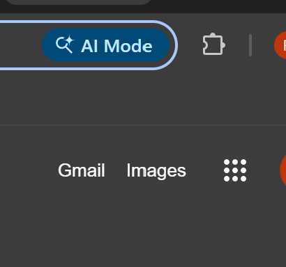
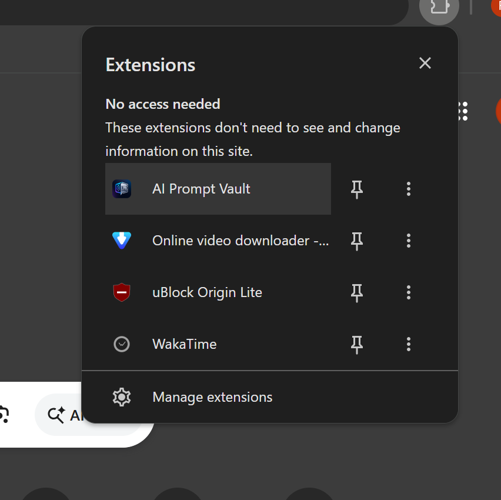
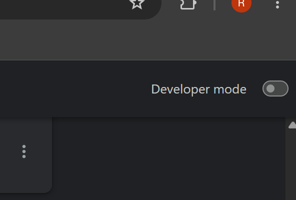
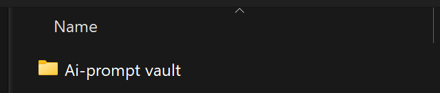

<<<<<<< HEAD
# ⚡ AI Prompt Vault

> **A premium Chrome extension to save, organize, search, and copy your AI prompts — with a modern glassmorphism UI, dark/light themes, tags, archive, trash, bulk actions, and full import/export support.**

---

## ✨ Features

### 🗂 Vault
- Save prompts with a **title**, **category**, and **tags**
- **Instant search** across title, category, tags, and prompt text
- **Filter** by Favorites ⭐ · Pinned 📌 · Archive 📦 · Trash 🗑
- **Sort** by Newest · Oldest · Last Edited · A–Z · Z–A
- **Truncated cards** with Read More / Read Less toggle
- **Multi-select** (long-press a card) for bulk delete

### 📝 Prompt Actions (per card)
| Action | What it does |
|---|---|
| 📋 Copy | Copies prompt text to clipboard |
| Ⓜ Copy MD | Copies as formatted Markdown |
| ✏️ Edit | Opens prompt in the editor |
| ⧉ Duplicate | Creates a copy of the prompt |
| 📌 Pin | Pins to the top of the list |
| ⭐ Favorite | Marks as a favorite |
| 📦 Archive | Moves to archive (hidden from main vault) |
| 🗑 Delete | Moves to trash with a **5-second Undo** option |

### 📊 Dashboard
- Total prompts, favorites, pinned, categories, archived, storage used
- Most used category
- Recently added & recently viewed prompts

### ⚙️ Settings
- 🌙 **Dark** / ☀️ **Light** theme
- Font size: Small · Medium · Large
- Card density: Compact · Normal · Airy
- Default sort preference
- Export: **JSON**, **CSV**, **Markdown**
- Import JSON (validates and deduplicates)
- Full **Backup & Restore**
- Empty Trash · Clear All Data

### ⌨️ Keyboard Shortcuts
| Shortcut | Action |
|---|---|
| `Ctrl + N` | Open New Prompt form |
| `Ctrl + F` | Focus the search bar |
| `Esc` | Cancel edit / clear search / exit multi-select |

---

=======
# 🚀 AI Prompt Vault

A Chrome extension to save, organize, search, pin, and instantly copy your frequently used AI prompts.

## ✨ Features

- 📝 Save prompts with a title and category
- 🔍 Search across titles, categories, and prompt text
- 📌 Pin important prompts to keep them at the top
- 🏷️ Category badges on every prompt
- 🎯 Filter prompts by category
- ⭐ Mark favorites and filter to show only favorites
- ↕️ Sort by newest, oldest, or alphabetically (A–Z / Z–A)
- 📋 One-click copy to clipboard
- 📤 Export prompts to a JSON file
- 📥 Import prompts from a JSON file

## 📦 Installation (Load Unpacked in Chrome)

Since this extension isn't published on the Chrome Web Store yet, install it manually in Developer Mode using the steps below.

### Step 1: Open the Extensions menu

Click the puzzle-piece icon in the Chrome toolbar (top right, next to the address bar).

![Click the Extensions icon]


### Step 2: Go to "Manage extensions"

In the panel that opens, click **Manage extensions** at the bottom.

![Click Manage extensions]


### Step 3: Turn on Developer mode

On the Extensions page, toggle **Developer mode** ON — it's in the top-right corner.

![Enable Developer mode]


### Step 4: Click "Load unpacked"

Once Developer mode is on, new buttons appear at the top of the page. Click **Load unpacked**.

![Click Load unpacked]


### Step 5: Select the extension folder

In the file picker, select the **Ai-prompt vault** folder (the folder containing `manifest.json`, `index.html`, `popup.js`, and `popup.css`), then click **Select Folder**.

![Select the Ai-prompt vault folder]


### Step 6: Pin it for easy access (optional)

Click the puzzle-piece icon again, find **AI Prompt Vault** in the list, and click the pin icon so it stays visible in your toolbar.

---

That's it! Click the **AI Prompt Vault** icon in your toolbar anytime to save, search, pin, and manage your AI prompts.

## 🔄 Updating the Extension

If you make changes to the code, go back to `chrome://extensions`, find **AI Prompt Vault**, and click the refresh/reload icon on its card to apply the changes.

>>>>>>> 0c17ce9f7bdda3fef0c781f3bc0a2f5d941575e3
## 📁 Project Structure

```
Ai-prompt vault/
<<<<<<< HEAD
├── manifest.json    ← Chrome Extension config (Manifest V3)
├── index.html       ← Popup UI (4-tab layout)
├── popup.js         ← All app logic (~700 lines, vanilla JS)
├── popup.css        ← Full design system (~600 lines, CSS variables)
└── icons/
    ├── icon16.png
    ├── icon48.png
    └── icon128.png
```

---

## 🔧 Installation Guide (Chrome — Developer Mode)

Since this extension is not yet published on the Chrome Web Store, you can install it manually in a few easy steps.

---

### Step 1 — Open the Extensions panel

Click the **puzzle-piece icon** (🧩) in the top-right corner of Chrome, next to the address bar.



---

### Step 2 — Click "Manage extensions"

In the panel that opens, scroll to the bottom and click **Manage extensions**.



---

### Step 3 — Enable Developer mode

On the Extensions page (`chrome://extensions`), toggle **Developer mode** ON — it is in the **top-right corner** of the page.



---

### Step 4 — Click "Load unpacked"

Once Developer mode is enabled, three buttons appear at the top of the page. Click **Load unpacked**.


---

### Step 5 — Select the extension folder

In the file picker that opens, navigate to and select the **Ai-prompt vault** folder — the one that contains `manifest.json`, `index.html`, `popup.js`, and `popup.css`. Then click **Select Folder**.



---

### Step 6 — Pin it to your toolbar *(optional but recommended)*

Click the puzzle-piece icon again, find **AI Prompt Vault** in the list, and click the **pin icon** 📌 so it stays visible in the toolbar at all times.

---

✅ **That's it!** Click the ⚡ AI Prompt Vault icon in your toolbar to start saving and organizing your prompts.

---

## 🔄 Updating the Extension

Whenever you make changes to the code:

1. Go to `chrome://extensions`
2. Find **AI Prompt Vault** on the page
3. Click the **↺ reload** icon on its card

Your changes will be applied immediately.

---

## 🛡 Permissions

| Permission | Why it's needed |
|---|---|
| `storage` | Saves your prompts, settings, and trash locally using `chrome.storage.local` |
| `clipboardWrite` | Enables one-click copy of prompt text to clipboard |

No data ever leaves your browser. Everything is stored locally on your device.

---

## 🚀 Upcoming (Possible Future Features)

- Drag-and-drop prompt reordering
- Collections / nested folders
- Chrome Web Store publish
- Cloud sync across devices

---

## 📄 License

This project is open source and free to use for personal and educational purposes.

---

*Built with ❤️ using Vanilla JS · HTML · CSS · Chrome Manifest V3*
=======
├── manifest.json    # Extension configuration
├── index.html       # Popup UI
├── popup.js         # App logic
├── popup.css        # Styling
└── icons/           # Extension icons
```
>>>>>>> 0c17ce9f7bdda3fef0c781f3bc0a2f5d941575e3
